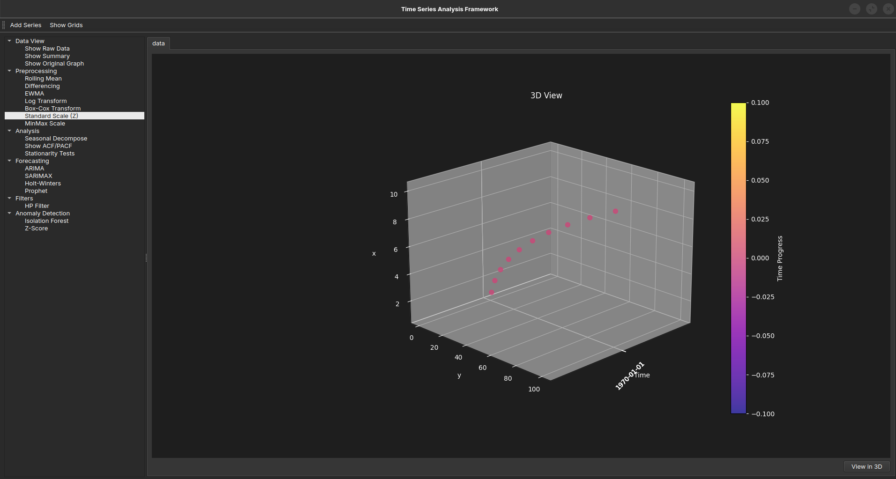
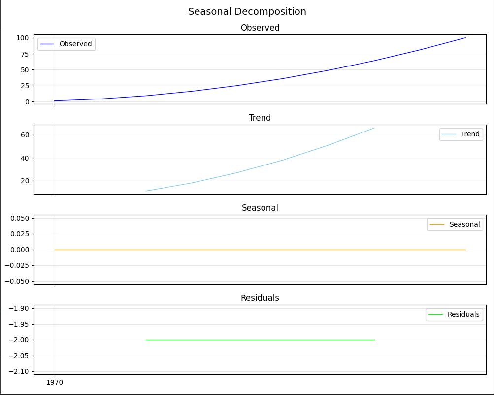
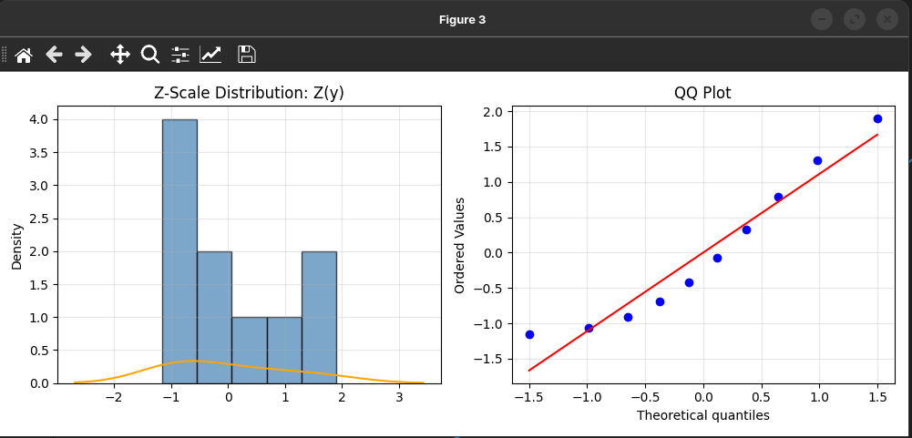
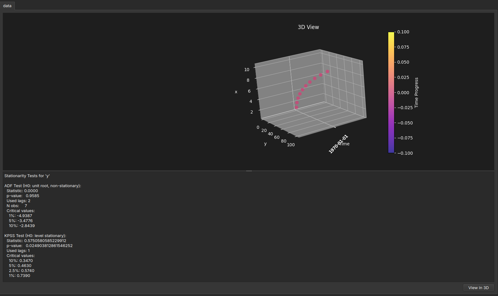

# QLab: Advanced Time-Series Analysis Software

A comprehensive, state-of-the-art PyQt6 application designed to load, process, analyze, and beautifully visualize time-series data from CSV files. 

## Application Gallery

Here's an overview of the beautiful and feature-rich PyQt6 interface:

### Main Interface


### Data Visualization


### Analysis & Controls


### Advanced Filtering



## Features at a Glance

- **Rich Visualization**: Interactive plots and intuitive data exploration workflows.
- **AI & Forecasting**: Integrated AI modules for predictive analytics and future trend forecasting.
- **Anomaly Detection**: Automatically pinpoint outliers and unusual patterns in your data.
- **Advanced Preprocessing & Filters**: Clean, smooth, and transform data using robust filtering algorithms.
- **Extensive Analysis Methods**: Access a wide array of built-in time-series methods and statistical tools.

## Installation

To get started, install the required dependencies using pip:

```bash
pip install -r requirements.txt
```

## Run the Application

Launch the main graphical interface with:

```bash
python -m src
```

## Sample Data (`data.csv`)

The project includes a sample `data.csv` containing numerical values that model a simple quadratic relationship ($y = x^2$):

| X  | Y   |
|:--:|:---:|
| 1  | 1   |
| 2  | 4   |
| 3  | 9   |
| 4  | 16  |
| 5  | 25  |
| 6  | 36  |
| 7  | 49  |
| 8  | 64  |
| 9  | 81  |
| 10 | 100 |

